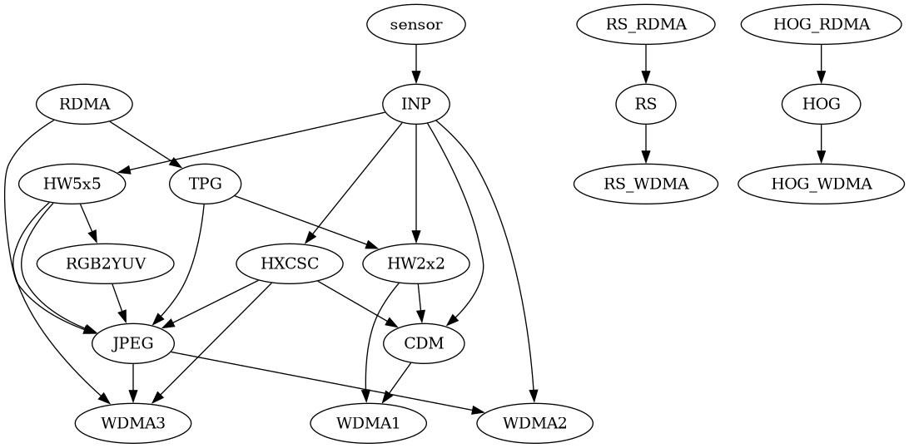

# Himax HX6538 Analysis

**DISCLAIMER:** all of this information was obtained from public
source, or guessed by looking at public source, and all information
disclosed here is already publicated on one of the sources listed
through this document.

This repository aims to study the HX5638 chip from Himax, also known as WiseEye2.

The repository that seems the most up to date and used is in this study is:
<https://github.com/HimaxWiseEyePlus/Seeed_Grove_Vision_AI_Module_V2/>

This analysis uses the `allon_sensor_tflm` example as reference, as it
is the most minimal and seems to support everything and work better.

Resources from Himax:

- High-level overview of the chip:
  <https://himaxwiseeyeplus.github.io/>

- Documentation of the libraries in the header files:
  <https://github.com/HimaxWiseEyePlus/Seeed_Grove_Vision_AI_Module_V2/tree/main/EPII_CM55M_APP_S/drivers/inc>

- Seeed Studio documentation:
  <https://wiki.seeedstudio.com/grove_vision_ai_v2_himax_sdk/>

- Description of the pipeline documented inside the configuration headers in the samples:
  <https://github.com/HimaxWiseEyePlus/Seeed_Grove_Vision_AI_Module_V2/blob/main/EPII_CM55M_APP_S/app/scenario_app/allon_sensor_tflm/cis_sensor/cis_imx219/cisdp_cfg.h>

## Organization of the SDK

According to
[this source](https://github.com/LynnL4/firmware-seeed-grove-vision-ai/tree/main/Synopsys_PA8535_EM9D_DFSS_SDK_3.3),
the Himax SDK is based on the Synopsys DesignWareCore suite: a modified
[Synopsys EM9D](https://www.synopsys.com/dw/ipdir.php?ds=smart-data-fusion-subsystem)
SoC o include an ARM core instead of a
[Synposys ARC EM9D](https://www.synopsys.com/dw/ipdir.php?ds=arc-em9d-em11d) core.

This means that while some details could differ, the peripherals working is essentialy the same as the ARC peripherals.
Some elements of this SDK are published as open-source [here](https://github.com/foss-for-synopsys-dwc-arc-processors/embarc_osp).

The SDK top level directory is `EPII_CM55M_APP_S`.

On some other SDKs, there is also a `EPII_CM55M_APP_M` directory for
the other core, that contains the same SDK but with modifications for
running on the other core.

## Glossary

- **EPII** means more or less WiseEye2.
- **DP** means datapath (see below).
- **HW2X2** means Hardware pixel conversion engine with 2x2 window.
- **HW5X5** means Hardware pixel conversion engine with 5x5 window.
- **JPEG** means hardware-based JPEG encoder.
- **JPEGENC** means software-based JPEG encoder.
- **DW** means DesignWare, the peripheral library of Synopsys
- **XDMA** is the engine that performs read or write DMA operations
- **WDMA1** means write DMA 1: supports 3 channels: `CH1`, `CH2`, `CH3`
- **WDMA2** means write DMA 2
- **WDMA3** means write DMA 3: supports 3 channels: `CH1`, `CH2`, `CH3`
- **RDMA1** means read DMA 1

## Organization of the DataPath

The "DataPath" is a collection of cores and a control system for it.

It is the name of the interconnection *between* the image processing
cores, that is responsible for the connection between the cores and
brings them to the memory for application processing.

From infromation collected on the headers, it was possible to decipher this graph:

### INP

MIPI or DVP input. It performs a conversion from MIPI to parallel
port internally, and processthe data from the parallel port using this
internal pipeline:

- Cropping from the input resolution to the target resolution
- Binning: averaging multiple pixels into one to reduce the resolution
  while taking advantage of the averaging to improve quality.
- Subsampling: dropping pixels to only keep fewer

The cropping output is passed to binning, further passed to subsampling,
further passed to the next core, i.e. HW5x5 or HW2x2.

By experience, cropping can be done for an arbitrary value with a single
pixel granularity, but binning and subsampling

Binning and subsampling can only be done by a list of dividers:

- 16to2 (i.e. 3200x2400 => 400x300)
- 10to2 (i.e. 3200x2400 => 640x480)
- 8to2 (i.e. 3200x2400 => 800x600)
- 6to2 (i.e. 3240x2400 => 610x800, which does not work when using HW5x5 flow apparently, maybe a limitation of HW5x5?)
- 4to2 (i.e. 3200x2400 => 1600x1200, not enough RAM, need to crop more)
